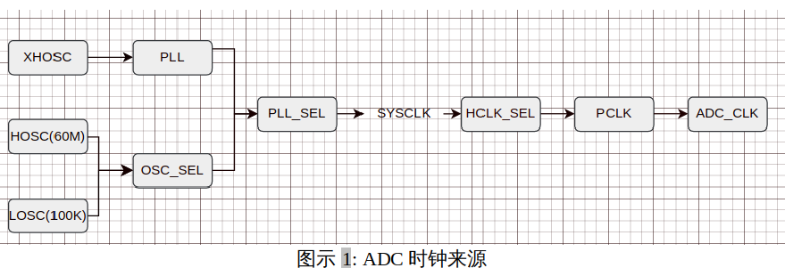

ADC驱动模块**
===============

硬件特性
--------

简介
^^^^^

16 位 ADC 模块的工作时钟最高为 56MHz 支持多达 8 个单端输入和 4
个差分输入的 ADC 信号的采集，一路采样保持电路，这些通道的 ADC
转换可在单次采样，多次采样取平均值，
简单连续采样（不切换通道），复杂连续采样（切换通道）模式下进行， ADC
的结果存储 在一个 16
位数据寄存器中，两个单端输入可以组成一个差分输入。差分输入和单端输入是
互斥的。

时钟（根据具体情况）
^^^^^^^^^^^^^^^^^^^^

ADC时钟来源于PCLK，PCLK由SYSCLK分频得到，而SYSCLK来自HCLK的分频，HCLK来自SYSCLK或SYSCLK的特殊分频，SYSCLK可选PLL、HOSC、LOSC三者之一。下图为M400单片机中与ADC相关的时钟结构图。

备注：M400的典型SYSCLK为200M。XHOSC为外部晶振，M400开发板MCU_dev
V1.0使用的XHOSC为30MHz。

输入输出引脚
^^^^^^^^^^^^^

外部输出引脚EXOUT
""""""""""""""""""

ADC模块不涉及输出引脚。

外部输入引脚EXIN
"""""""""""""""""

ADC最多支持8路单端或
4路差分输入信号的采集，每个单端采集对应一个外部输入引脚(也即每组差分输入对应两个输入引脚例如在原理图上面第0组差分输入的两个输入引脚分别为ADC_IN<0>和ADC_IP<0>)，除此之外还有两个参考电压的输入引脚分别为正参考电压VREFP和负参考电压VREFN

表格 2.1: ADC 输入引脚功能IO复用表

+--------------------+----------+---------------+
| Pin编号（144封装） | 第几功能 | 输入源        |
+--------------------+----------+---------------+
| 27                 | OPTION 0 | ADC_IN< 3>    |
+--------------------+----------+---------------+
| 28                 | OPTION 0 | ADC_IP< 3>    |
+--------------------+----------+---------------+
| 29                 | OPTION 0 | ADC_IN< 2>    |
+--------------------+----------+---------------+
| 30                 | OPTION 0 | ADC_IP< 2>    |
+--------------------+----------+---------------+
| 31                 | OPTION 0 | ADC_IN< 1>    |
+--------------------+----------+---------------+
| 32                 | OPTION 0 | ADC_IP< 1>    |
+--------------------+----------+---------------+
| 33                 | OPTION 0 | ADC_IN< 0>    |
+--------------------+----------+---------------+
| 34                 | OPTION 0 | ADC_IP< 0>    |
+--------------------+----------+---------------+
| 35                 | OPTION 0 | VREFP         |
+--------------------+----------+---------------+
| 36                 | OPTION 0 | VREFN （VSS） |
+--------------------+----------+---------------+

ADC模块功能
^^^^^^^^^^^^^^

单数值采样模式
"""""""""""""""""""""

功能2（根据具体情况）
"""""""""""""""""""""

功能3（根据具体情况）
"""""""""""""""""""""

硬件中断
^^^^^^^^^^

关键数据结构
--------------

编程接口
---------------

应用层编程接口
^^^^^^^^^^^^^^^

接口1
""""""

接口2
"""""""

接口3
"""""

接口4
"""""""""

接口5
"""""""""

驱动层接口
^^^^^^^^^^^

驱动功能
---------

功能1（根据具体情况）
^^^^^^^^^^^^^^^^^^^^^

功能2（根据具体情况）
^^^^^^^^^^^^^^^^^^^^^

功能3（根据具体情况）
^^^^^^^^^^^^^^^^^^^^^

驱动中断
^^^^^^^^^^

ADC驱动设计
-------------

驱动框架
^^^^^^^^^

设备注册流程
"""""""""""""

设备使用流程
""""""""""""""

详细设计
^^^^^^^^^^

软件框架设计
"""""""""""""

操作函数集
""""""""""""

中断处理
""""""""""""

功能实现
^^^^^^^^^

功能1（根据具体情况）
**********************

功能2（根据具体情况）
**********************

功能3（根据具体情况）
**********************

GPIO设置（根据具体情况）
***************************

编程示例
---------
